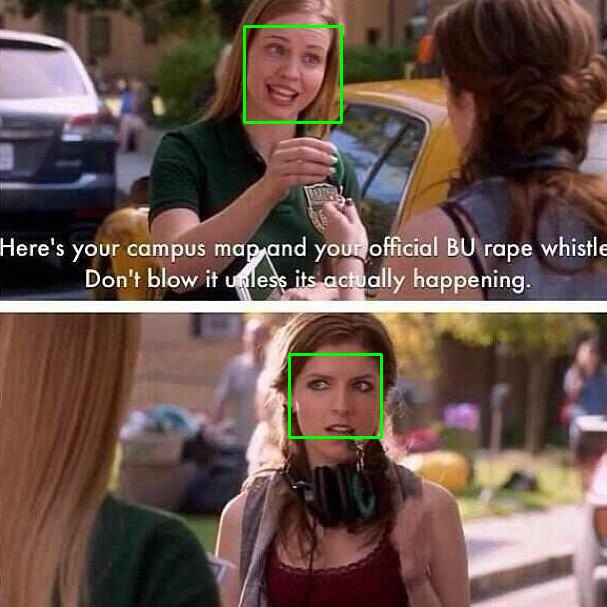
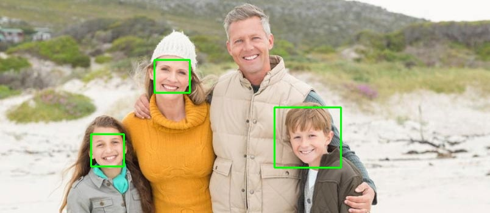

## a Pytorch Implementation Of Yolo V3


### 1.Introduction:

YOLOv3 is an object detection algorithm (based on neural nets) which can be used detect objects in live videos or static images, it is one of the fastest and accurate object detection method to date.


### 2.Installation:

If you want to install package dependencies of this project, please install via requirements.txt

```console
pip install -r requirements.txt
```

### Training:

### Some Results:






